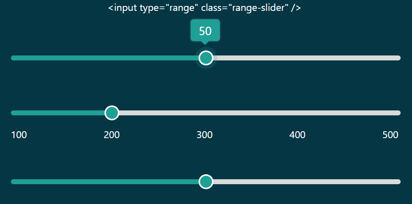

# Range Slider with Popover

converts HTML5 range input field into an interactive slider.



<br />

Just add a link to the css file in your `<head>`:

```html
<link href="dist/range-slider.min.css" rel="stylesheet" />
```
Then, before your closing ```<body>``` tag add:

```html
<script src="dist/range-slider.min.js"></script>
```
Now, add the class "range-slider" to your input type=range elements:

```html
<input type="range" class="range-slider" />
```

### Browser compatibility

Chrome | Edge | Firefox | Opera | Safari
------ | ---- | ------- | ----- | -----
114 | 114 | 125 | 100| 17


### [Demo and detailed documentation ↗](https://karan-rocks.github.io/range-slider/)

